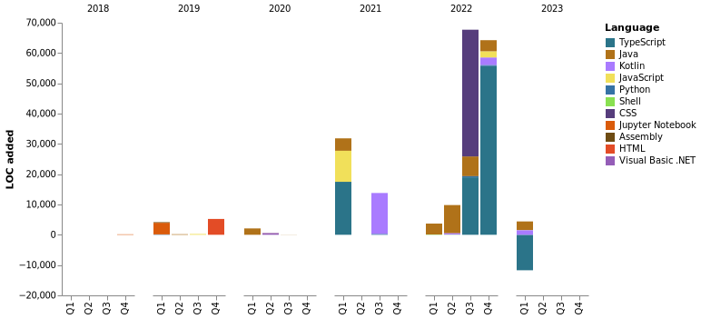

### :bust_in_silhouette: **Sobre mim** 
Graduado em Análise e Desenvolvimento de Sistemas pela Fatec Zona Leste e técnico em informática pela ETEC Zona Leste, já atuei com manutenção de computadores, desenvolvimento e análise de sistemas. Atualmente trabalhando no desenvolvimento de microsserviços e APIs usando Java, Spring Boot, Apache Kafka e SQL Server. Além disso, tenho alguns projetos usando outras linguagens como javascript, Kotlin, PHP, Assembly, Python e Shell Script, etc. Entusiasta do open source e usando uma distro nova por semana.

---

### :calling: **Como me contatar...**

**Nas minhas redes sociais:**

<a href="https://api.whatsapp.com/send?phone=5511930093018"></a>
<a href="https://www.linkedin.com/in/gustavo-silva-69b84a15b/"></a>
<a href="https://www.instagram.com/gasfgrv/"></a>
<a href="https://www.facebook.com/gAlmeida11"></a>
<a href="https://discordapp.com/users/616994765065420801"></a>

**Me mandando um e-mail**

<a href="mailto:gustavoalmeidasilva41@gmail.com"></a>
<a href="mailto:gustavo_almeida11@hotmail.com"></a>


**O que estou jogando:**

<a href="https://psnprofiles.com/gustavo_11845"></a>

**O que estou ouvindo:**

[](https://spotify-github-profile.vercel.app/api/view?uid=316iwsuurk4wrc72ys5gle37hpei&redirect=true)

---

### :books: **Por onde estudei**

- Análise e Desenvolvimento de Sistemas – concluído em 2020 - Faculdade de Tecnologia da Zona Leste (FATEC ZL)
- Técnico em Informática – concluído em 2016 - Escola Técnica da Zona Leste (ETEC ZL)

---

### :briefcase: **Por onde trabalhei**

- Itaú unibanco - Analista de engenharia de TI jr, setembro de 2021 - atual;
- Autbank Projetos e Consultoria Ltda - Análista programador, julho de 2020 - setembro de 2021;
- Departamento de Trânsito de São Paulo - Estagiário, fevereiro de 2019 – junho de 2020.
- ArcNet Desenvolvimento de Software – Estagiário, novembro de 2018 até dezembro de 2018.
- Instituto Paulista de Geriatria e Gerontologia – Estagiário, julho de 2018 até novembro de 2018.
- Secretaria de Educação do Estado de São Paulo - Jovem Aprendiz Administrativo, setembro de 2013 até  dezembro de 2014.

---

### :page_facing_up: **O que já escrevi**

- [Lgpd: Atuação na Prevenção de Vazamento de Dados](https://even3.blob.core.windows.net/even3publicacoes-assets/tcc/428254-lgpd-atuacao-na-prevencao-de-vazamento-de-dados-282544.pdf)
- [Blockchain no Mercado Financeiro](https://www.linkedin.com/pulse/blockchain-mercado-financeiro-gustavo-silva/)

---

### :tv: **Meus últimos vídeos**   

<!-- YOUTUBE:START -->
- [Blockchain com Node.js](https://www.youtube.com/watch?v=8kxP_VkRicA)
- [Java com SQLite](https://www.youtube.com/watch?v=7SEDCJzaeb8)
- [ICONIX Process](https://www.youtube.com/watch?v=c8M5Q30f9h4)
- [Laboratório de Hardware - Setup da BIOS.](https://www.youtube.com/watch?v=pDuf8UUzL0Q)
<!-- YOUTUBE:END -->
   
➡️ [Mais videos em...](https://www.youtube.com/channel/UCXKb8To1OWsDy6dqf4oM-_g)

###  :chart_with_upwards_trend: **Sobre o meu canal**  


---

### :watch: **Métricas de Desenvolvimento - Wakatime**



<!--START_SECTION:waka-->


**🐱 My GitHub Data** 

> 📦 75.3 kB Used in GitHub's Storage 
 > 
> 🏆 658 Contributions in the Year 2023
 > 
> 💼 Opted to Hire
 > 
> 📜 90 Public Repositories 
 > 
> 🔑 3 Private Repositories 
 > 
**I'm an Early 🐤** 

```text
🌞 Morning                71 commits          ██░░░░░░░░░░░░░░░░░░░░░░░   07.40 % 
🌆 Daytime                440 commits         ███████████░░░░░░░░░░░░░░   45.83 % 
🌃 Evening                322 commits         ████████░░░░░░░░░░░░░░░░░   33.54 % 
🌙 Night                  127 commits         ███░░░░░░░░░░░░░░░░░░░░░░   13.23 % 
```
📅 **I'm Most Productive on Wednesday** 

```text
Monday                   113 commits         ███░░░░░░░░░░░░░░░░░░░░░░   11.77 % 
Tuesday                  103 commits         ███░░░░░░░░░░░░░░░░░░░░░░   10.73 % 
Wednesday                288 commits         ████████░░░░░░░░░░░░░░░░░   30.00 % 
Thursday                 122 commits         ███░░░░░░░░░░░░░░░░░░░░░░   12.71 % 
Friday                   110 commits         ███░░░░░░░░░░░░░░░░░░░░░░   11.46 % 
Saturday                 107 commits         ███░░░░░░░░░░░░░░░░░░░░░░   11.15 % 
Sunday                   117 commits         ███░░░░░░░░░░░░░░░░░░░░░░   12.19 % 
```


📊 **This Week I Spent My Time On** 

```text
🕑︎ Time Zone: America/Sao_Paulo

💬 Programming Languages: 
Java                     5 hrs 8 mins        ███████████░░░░░░░░░░░░░░   45.14 % 
Terraform                2 hrs 49 mins       ██████░░░░░░░░░░░░░░░░░░░   24.72 % 
YAML                     1 hr 5 mins         ██░░░░░░░░░░░░░░░░░░░░░░░   09.53 % 
Smarty                   51 mins             ██░░░░░░░░░░░░░░░░░░░░░░░   07.58 % 
XML                      22 mins             █░░░░░░░░░░░░░░░░░░░░░░░░   03.33 % 

🔥 Editors: 
IntelliJ                 11 hrs 10 mins      █████████████████████████   98.04 % 
VS Code                  13 mins             ░░░░░░░░░░░░░░░░░░░░░░░░░   01.96 % 

🐱‍💻 Projects: 
dynamoDB-api             4 hrs 53 mins       ███████████░░░░░░░░░░░░░░   42.84 % 
login                    2 hrs 36 mins       ██████░░░░░░░░░░░░░░░░░░░   22.82 % 
jwt-login                2 hrs 29 mins       █████░░░░░░░░░░░░░░░░░░░░   21.86 % 
odontosys                55 mins             ██░░░░░░░░░░░░░░░░░░░░░░░   08.11 % 
Unknown Project          15 mins             █░░░░░░░░░░░░░░░░░░░░░░░░   02.33 % 

💻 Operating System: 
Linux                    11 hrs 24 mins      █████████████████████████   100.00 % 
```

**I Mostly Code in Java** 

```text
Java                     47 repos            ██████████████░░░░░░░░░░░   54.65 % 
Python                   13 repos            ████░░░░░░░░░░░░░░░░░░░░░   15.12 % 
Kotlin                   5 repos             █░░░░░░░░░░░░░░░░░░░░░░░░   05.81 % 
HTML                     4 repos             █░░░░░░░░░░░░░░░░░░░░░░░░   04.65 % 
TypeScript               4 repos             █░░░░░░░░░░░░░░░░░░░░░░░░   04.65 % 
```


**Timeline**


 Last Updated on 27/02/2023 01:06:50 UTC
<!--END_SECTION:waka-->

### :information_source: **Contribuições**


### :bar_chart: **Estatísticas**


### :computer: **Linguagens mais usadas**


---

### :busts_in_silhouette: **Pessoas que conheço**


