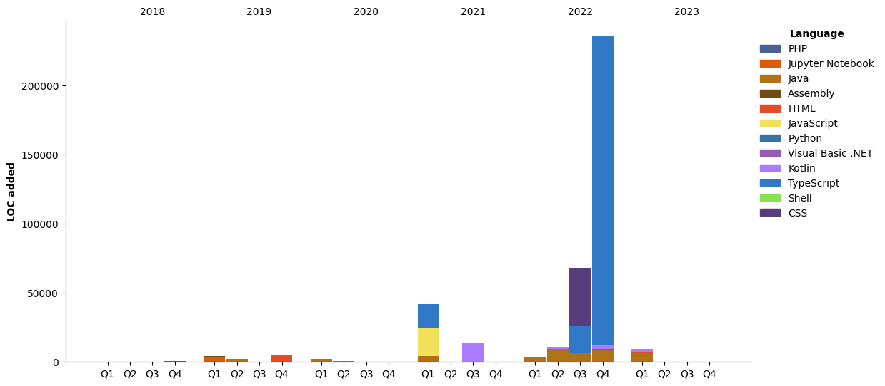

### :bust_in_silhouette: **Sobre mim** 
Graduado em Análise e Desenvolvimento de Sistemas pela Fatec Zona Leste e técnico em informática pela ETEC Zona Leste, já atuei com manutenção de computadores, desenvolvimento e análise de sistemas. Atualmente trabalhando no desenvolvimento de microsserviços e APIs usando Java, Spring Boot, Apache Kafka e SQL Server. Além disso, tenho alguns projetos usando outras linguagens como javascript, Kotlin, PHP, Assembly, Python e Shell Script, etc. Entusiasta do open source e usando uma distro nova por semana.

---

### :calling: **Como me contatar...**

**Nas minhas redes sociais:**

<a href="https://api.whatsapp.com/send?phone=5511930093018"></a>
<a href="https://www.linkedin.com/in/gustavo-silva-69b84a15b/"></a>
<a href="https://www.instagram.com/gasfgrv/"></a>
<a href="https://www.facebook.com/gAlmeida11"></a>
<a href="https://discordapp.com/users/616994765065420801"></a>

**Me mandando um e-mail**

<a href="mailto:gustavoalmeidasilva41@gmail.com"></a>
<a href="mailto:gustavo_almeida11@hotmail.com"></a>


**O que estou jogando:**

<a href="https://psnprofiles.com/gustavo_11845"></a>

**O que estou ouvindo:**

[](https://spotify-github-profile.vercel.app/api/view?uid=316iwsuurk4wrc72ys5gle37hpei&redirect=true)

---

### :books: **Por onde estudei**

- Análise e Desenvolvimento de Sistemas – concluído em 2020 - Faculdade de Tecnologia da Zona Leste (FATEC ZL)
- Técnico em Informática – concluído em 2016 - Escola Técnica da Zona Leste (ETEC ZL)

---

### :briefcase: **Por onde trabalhei**

- Itaú unibanco - Analista de engenharia de TI jr, setembro de 2021 - atual;
- Autbank Projetos e Consultoria Ltda - Análista programador, julho de 2020 - setembro de 2021;
- Departamento de Trânsito de São Paulo - Estagiário, fevereiro de 2019 – junho de 2020.
- ArcNet Desenvolvimento de Software – Estagiário, novembro de 2018 até dezembro de 2018.
- Instituto Paulista de Geriatria e Gerontologia – Estagiário, julho de 2018 até novembro de 2018.
- Secretaria de Educação do Estado de São Paulo - Jovem Aprendiz Administrativo, setembro de 2013 até  dezembro de 2014.

---

### :page_facing_up: **O que já escrevi**

- [Lgpd: Atuação na Prevenção de Vazamento de Dados](https://even3.blob.core.windows.net/even3publicacoes-assets/tcc/428254-lgpd-atuacao-na-prevencao-de-vazamento-de-dados-282544.pdf)
- [Blockchain no Mercado Financeiro](https://www.linkedin.com/pulse/blockchain-mercado-financeiro-gustavo-silva/)

---

### :tv: **Meus últimos vídeos**   

<!-- YOUTUBE:START -->
- [Blockchain com Node.js](https://www.youtube.com/watch?v=8kxP_VkRicA)
- [Java com SQLite](https://www.youtube.com/watch?v=7SEDCJzaeb8)
- [ICONIX Process](https://www.youtube.com/watch?v=c8M5Q30f9h4)
- [Laboratório de Hardware - Setup da BIOS.](https://www.youtube.com/watch?v=pDuf8UUzL0Q)
<!-- YOUTUBE:END -->
   
➡️ [Mais videos em...](https://www.youtube.com/channel/UCXKb8To1OWsDy6dqf4oM-_g)

###  :chart_with_upwards_trend: **Sobre o meu canal**  


---

### :watch: **Métricas de Desenvolvimento - Wakatime**



<!--START_SECTION:waka-->


**🐱 My GitHub Data** 

> 🏆 626 Contributions in the Year 2023
 > 
> 📦 74.7 kB Used in GitHub's Storage 
 > 
> 💼 Opted to Hire
 > 
> 📜 86 Public Repositories 
 > 
> 🔑 3 Private Repositories  
 > 
**I'm a Night 🦉** 

```text
🌞 Morning       56 commits       ██░░░░░░░░░░░░░░░░░░░░░░░   08.64 % 
🌆 Daytime      206 commits       ████████░░░░░░░░░░░░░░░░░   31.79 % 
🌃 Evening      280 commits       ██████████░░░░░░░░░░░░░░░   43.21 % 
🌙 Night        106 commits       ████░░░░░░░░░░░░░░░░░░░░░   16.36 % 

```
📅 **I'm Most Productive on Monday** 

```text
Monday         105 commits       ████░░░░░░░░░░░░░░░░░░░░░   16.20 % 
Tuesday         96 commits       ███░░░░░░░░░░░░░░░░░░░░░░   14.81 % 
Wednesday       83 commits       ███░░░░░░░░░░░░░░░░░░░░░░   12.81 % 
Thursday        90 commits       ███░░░░░░░░░░░░░░░░░░░░░░   13.89 % 
Friday          84 commits       ███░░░░░░░░░░░░░░░░░░░░░░   12.96 % 
Saturday        93 commits       ███░░░░░░░░░░░░░░░░░░░░░░   14.35 % 
Sunday          97 commits       ███░░░░░░░░░░░░░░░░░░░░░░   14.97 % 

```


📊 **This Week I Spent My Time On** 

```text
⌚︎ Time Zone: America/Sao_Paulo

💬 Programming Languages: 
Java                     8 hrs 39 mins       ███████████████████░░░░░░   76.94 % 
YAML                     52 mins             ██░░░░░░░░░░░░░░░░░░░░░░░   07.75 % 
HTML                     49 mins             █░░░░░░░░░░░░░░░░░░░░░░░░   07.37 % 
JSON                     34 mins             █░░░░░░░░░░░░░░░░░░░░░░░░   05.11 % 
Properties               9 mins              ░░░░░░░░░░░░░░░░░░░░░░░░░   01.43 % 

🔥 Editors: 
IntelliJ                 9 hrs 31 mins       █████████████████████░░░░   84.70 % 
VS Code                  1 hr 43 mins        ███░░░░░░░░░░░░░░░░░░░░░░   15.30 % 

🐱‍💻 Projects: 
odontosys                7 hrs 42 mins       █████████████████░░░░░░░░   68.60 % 
oauthsocial              3 hrs 30 mins       ███████░░░░░░░░░░░░░░░░░░   31.25 % 
Unknown Project          1 min               ░░░░░░░░░░░░░░░░░░░░░░░░░   00.16 % 

💻 Operating System: 
Linux                    11 hrs 14 mins      █████████████████████████   100.00 % 

```

**I Mostly Code in Java** 

```text
Java                     46 repos            █████████████░░░░░░░░░░░░   55.42 % 
Python                   13 repos            ████░░░░░░░░░░░░░░░░░░░░░   15.66 % 
Kotlin                   5 repos             █░░░░░░░░░░░░░░░░░░░░░░░░   06.02 % 
JavaScript               4 repos             █░░░░░░░░░░░░░░░░░░░░░░░░   04.82 % 
TypeScript               4 repos             █░░░░░░░░░░░░░░░░░░░░░░░░   04.82 % 

```


**Timeline**

 


 Last Updated on 14/02/2023 10:18:38 UTC
<!--END_SECTION:waka-->

### :information_source: **Contribuições**


### :bar_chart: **Estatísticas**


### :computer: **Linguagens mais usadas**


---

### :busts_in_silhouette: **Pessoas que conheço**


